# 大家好！我是旋转矩阵

最近通过 Vibe Coding 方式开发了一款 Skill —— wechat-tutorial-editor-publisher，能够通过 OpenClaw 快速完成一篇公众号教程的编写和发布。作为独立开发者，我之前每次写教程都要手动排版、找图、上传，繁琐得很。现在有了这个 Skill，一篇文章从创作到发布全程自动化，省时又省力 🚀

# 什么是Wechat Tutorial Editor Publisher？

简单说，这是一套帮你快速生成公众号教程文章的Skill。它能让你：

- 通过可视化界面填写教程步骤
- AI 自动根据步骤生成完整的 Markdown 文章
- 一键将文章发布到微信公众号草稿箱

整个流程下来，你只需要填写步骤、等待 AI 写完、审核发布，三步搞定一篇教程！

## 步骤简介

- 编写需求文档并生成代码
- SKILL.md流程手册编写
- 教程模板编写
- 加载Skill并启动服务
- 提交个人信息
- 编辑教程
- 保存全部信息并生成step.json
- Agent编写教程
- 审核内容
- Agent发布教程

## 步骤详解

### 1. 编写需求文档并生成代码

首先，编写需求文档，明确这个工具要实现什么功能。

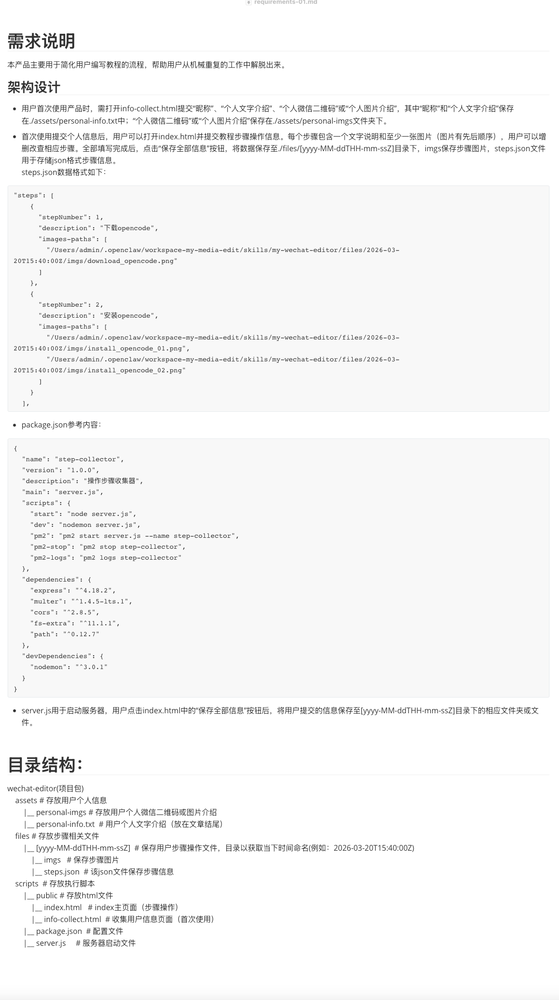

在需求文档中，主要说明：

- **需求说明**：这个产品主要用于简化用户编写教程的流程，帮助用户从机械重复工作中解脱出来
- **架构设计**：包括初始用户流程、步骤提交流程、steps.json 数据格式示例
- **目录结构**：明确项目的文件夹组织方式

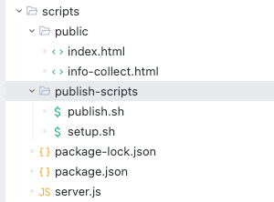

将需求文档发给任意一款 AI IDE生成代码，我使用的是Trae。

项目目录结构包含：

- `assets/`：存放个人信息和个人图片
- `files/`：存放带时间戳的步骤文件夹
- `scripts/`：包含 public 文件夹（前端页面）、server.js（后端服务）

### 2. SKILL.md流程手册编写（文章编辑部分）

编写 SKILL.md 文件，定义文章编辑的工作流程。

整个 skill 的核心定义包括：

- **name**：技能名称
- **description**：技能描述
- **metadata**：元数据，如 emoji 图标

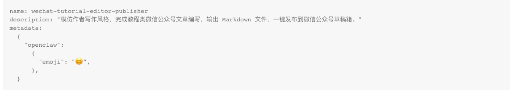

**首次执行**的步骤：

1. 初始化：执行 `npm init -y`
2. 安装依赖：`npm install`
3. 运行 server.js：`node server.js`
4. 浏览器打开 `http://localhost:3000/`
5. 收集用户信息并保存
6. 参考文章样例模仿写作风格

**非首次执行**的步骤：

1. 打开个人信息文件获取昵称和简介
2. 启动服务器并打开填写页面
3. 找到 steps.json 和头图，填入模板
4. 编写完整的教程文章
5. 拟定标题
6. 添加个人简介和二维码
7. 保存 Markdown 文件
8. 用户确认后发布

### 3. SKILL.md流程手册编写（教程发布部分）

继续完善 SKILL.md，添加教程发布的功能说明。

这部分是基于开源项目 wenyan-cli 的功能封装：

- ✅ Markdown 自动转换为微信公众号格式
- ✅ 自动上传图片到微信图床
- ✅ 一键推送到草稿箱
- ✅ 多主题支持
- ✅ 支持本地和网络图片

**快速开始指南：**

1. 安装 wenyan-cli：`npm install -g @wenyan-md/cli`
2. 配置 API 凭证（AppID 和 AppSecret）

**加载 Markdown 文件时的关键要求：**

- 必须包含完整的 frontmatter
- `title` 和 `cover` 都是必填字段！
- 缺少任何一个都会报错："未能找到文章封面"

**常见故障排查：**

- IP 不在白名单 → 添加到微信后台
- wenyan-cli 未安装 → 全局安装
- 环境变量未设置 → 配置 WECHAT_APP_ID 和 WECHAT_APP_SECRET

### 4. 教程模板编写

编写 article-pattern.md 模板，规范文章结构。

Json 结构：

```json
{
  "steps": [
    {
      "stepNumber": 1,
      "description": "测试1",
      "images-paths": [
        "imgs/1-1.jpeg",
        "imgs/1-2.jpg"
      ]
    },
    {
      "stepNumber": 2,
      "description": "测试2",
      "images-paths": [
        "imgs/2-1.png"
      ]
    }
  ]
}
```

模板包含以下关键部分：

- **正文第一句**：`大家好！我是{{昵称}}`
- **正文第一段**：200字左右的摘要
- **头图**：使用相对路径引用
- **步骤简介**：使用无序项目符号罗列
- **步骤详解**：每个步骤配图并详细解释
- **总结**：技术特点分析
- **结尾**：个人介绍及二维码

### 5. 加载Skill并启动服务

在 OpenClaw 中加载 skill 并启动服务。

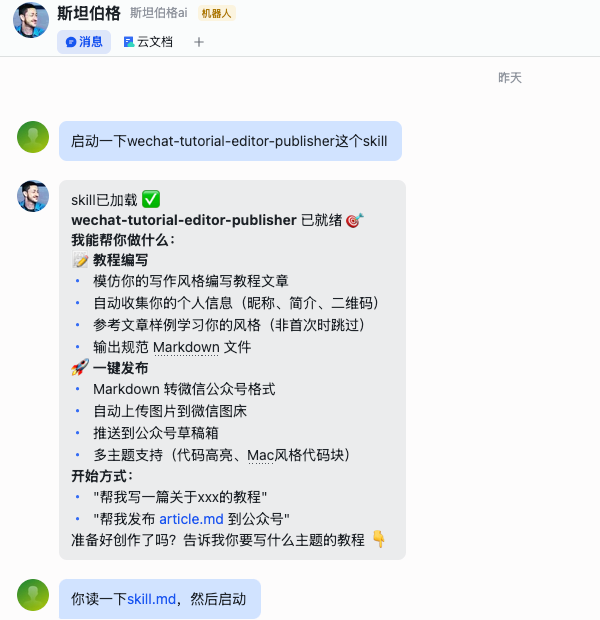

首次使用加载时间较长，需耐心等待。

技能加载成功后，系统会显示：

- ✅ 服务器已启动成功！
- 🎯 wechat-tutorial-editor-publisher 服务运行中
- 🌐 访问地址

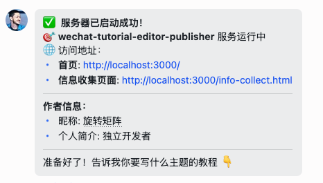

### 6. 提交个人信息

填写个人信息表单。

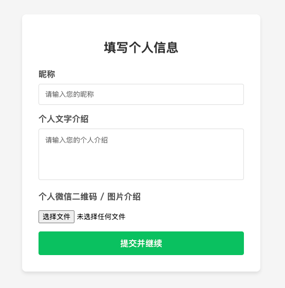

需要填写：

- **昵称**：你的名字
- **个人文字介绍**：个人简介
- **个人微信二维码/图片**：上传二维码图片

点击"提交并继续"保存信息。

### 7. 编辑教程

在步骤编辑页面填写教程的具体步骤。

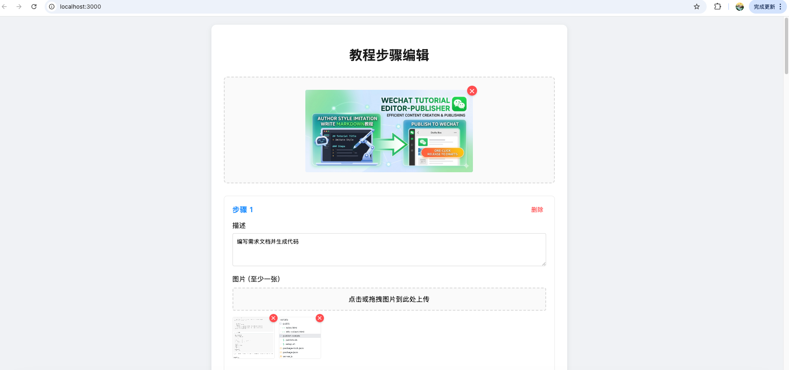

每个步骤需要：

- **描述**：简要说明操作流程（20字以内）
- **图片**：至少上传一张图片

### 8. 保存全部信息并生成steps.json

保存所有步骤信息。

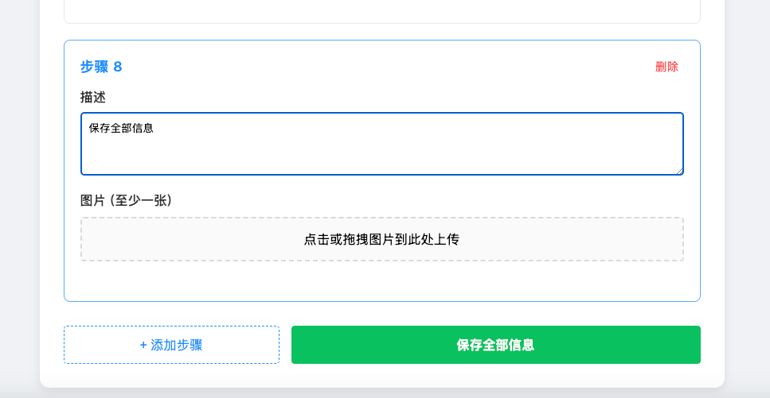

确认保存后，系统会生成 steps.json 文件，包含：

- cover：头图路径
- steps：步骤数组（包含序号、描述、图片路径）

### 9. Agent编写教程

让 OpenClaw Agent 根据 steps.json 编写完整的教程文章。

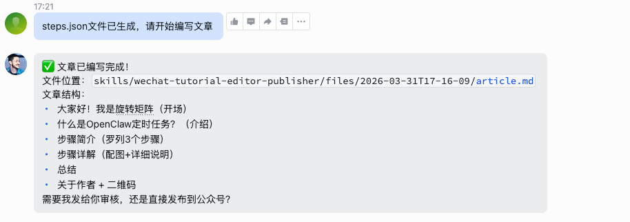

Agent 会：

- 读取步骤详情
- 分析每张图片的内容
- 按照模板生成完整的 Markdown 文章
- 添加头图、个人简介和二维码

### 10. 审核内容

审核 AI 生成的教程文章。

Agent 将文章编写完成后，让它帮你打开Markdown 文档，你可以作适当修改、调整或优化，确认并保存。

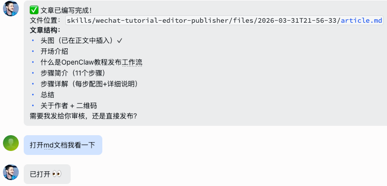

### 11. Agent发布教程

将文章发布到微信公众号。

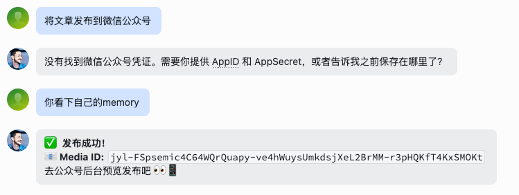

发布成功后会返回 Media ID：

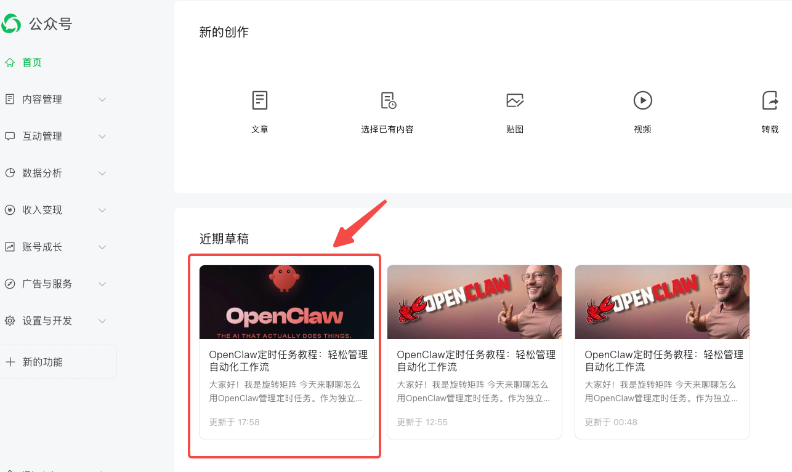

然后去公众号后台预览发布即可！

# 总结

关于 Wechat Tutorial Editor Publisher：

- ✅ **可视化操作**：点点鼠标就能完成步骤填写
- ✅ **AI 自动写作**：根据步骤自动生成完整文章
- ✅ **一键发布**：Markdown 转公众号格式并上传图片
- ✅ **多主题支持**：可选多种排版主题

Skill 已发布至 Clawhub，完全开源免费 : https://clawhub.ai/niko-yang-arch/wechat-tutorial-editor-publisher

你可以通过 OpenClaw 命令行搜索并安装：

```
$ openclaw search "wechat-tutorial-editor-publisher"
$ openclaw install wechat-tutorial-editor-publisher
```

对于需要频繁写教程的朋友来说，可以多多试用并提出宝贵意见，我会持续优化迭代😊

---

# 关于作者

独立开发者。
欢迎添加个人好友（标明来源，否则不通过）。


